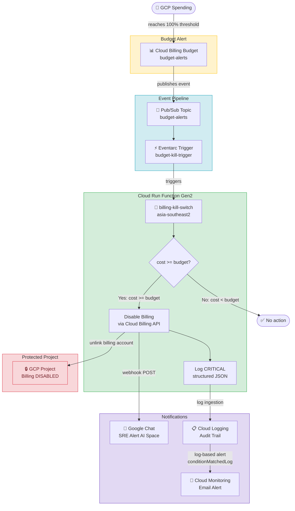

# gcp-billing-kill-switch

Claude Code skill to deploy a serverless GCP billing kill switch. Automatically disables project billing when a 100% budget alert fires. Uses Pub/Sub + Eventarc + Cloud Run Gen2.

> ⚠️ **DESTRUCTIVE**: Disabling billing stops all services in the project. Use only when going offline is safer than unlimited spend.

## Install Skill

```bash
git clone https://github.com/satriawandicky/gcp-billing-kill-switch.git
cp gcp-billing-kill-switch/commands/gcp-billing-kill-switch.md ~/.claude/commands/
```

Invoke in Claude Code:
```
/gcp-billing-kill-switch
```

Claude will prompt for the required variables below before proceeding.

---

## Required Variables

| Variable | Example | Description |
|---|---|---|
| `PROJECT_ID` | `my-project-prod` | GCP project to protect (billing will be disabled on breach) |
| `BILLING_ACCOUNT_ID` | `01E24F-97C25D-DB772B` | Billing account linked to the project (format: `XXXXXX-XXXXXX-XXXXXX`) |
| `REGION` | `asia-southeast2` | Cloud Run deployment region (default: `asia-southeast2`) |
| `BUDGET_AMOUNT` | `100` | Monthly budget cap — number only, no currency symbol |
| `CURRENCY_CODE` | `IDR` / `USD` / `GBP` | Must match the billing account currency |

### Optional Variables

| Variable | Example | Description |
|---|---|---|
| `GCHAT_WEBHOOK_URL` | `https://chat.googleapis.com/v1/spaces/...` | Google Chat webhook for kill switch alerts |
| `ALERT_EMAIL` | `admin@example.com` | Email for Cloud Monitoring alert when kill switch fires |

---

## Architecture



### Component Table

| # | Component | Technology | Role |
|---|---|---|---|
| 1 | Budget Alert | Cloud Billing | Detects spend ≥ 100% budget |
| 2 | Pub/Sub Topic | `budget-alerts` | Event broker |
| 3 | Eventarc Trigger | `budget-kill-trigger` | Routes Pub/Sub → Cloud Run |
| 4 | Cloud Run Function | Python 3.12, Gen2 | Kill switch logic |
| 5 | Cloud Billing API | `updateProjectBillingInfo` | Unlinks billing from project |
| 6 | Google Chat | Incoming Webhook | Real-time alert to Space |
| 7 | Cloud Monitoring | Log-based alert policy | Email notification on trigger |
| 8 | Secret Manager | `gchat-killswitch-webhook` | Stores webhook URL securely |
| 9 | Cloud Logging | Structured JSON logs | Full audit trail |

## What the Skill Does (Fully Automated)

1. Enables all required GCP APIs
2. Creates dedicated Service Account with least-privilege IAM
3. Creates Pub/Sub topic `budget-alerts`
4. Writes and deploys Cloud Run Function (Python 3.12, Gen2)
5. Creates Eventarc trigger
6. Stores Google Chat webhook in Secret Manager
7. Sets up Cloud Monitoring email alert
8. Runs end-to-end test and restores billing after test

**One manual step**: Connect budget alert to Pub/Sub via GCP Console (GCP API limitation for reseller sub-accounts).

---

## Source Code

See [`source/`](./source/) for the Cloud Run function files:
- `main.py` — kill switch logic with Google Chat + structured logging
- `requirements.txt` — Python dependencies
- `Procfile` — Cloud Run entry point (required for functions-framework)

---

## IAM Requirements

| Role | Level | Purpose |
|---|---|---|
| `roles/run.invoker` | Project | Allow Eventarc to trigger Cloud Run |
| `roles/viewer` | Project | Read project info |
| `roles/billing.projectManager` | Project | Unlink billing from project |
| `roles/billing.admin` | **Billing Account** ⚠️ | Manage billing account associations |

> ⚠️ `roles/billing.admin` must be at **Billing Account** level. `roles/billing.projectManager` must be at **Project** level. Both are required — missing either causes 403.

---

## Notifications

### Google Chat (Opsi 1)
Webhook stored in Secret Manager → injected as env var `GCHAT_WEBHOOK_URL`.
Message sent to your Space when kill switch fires.

### Cloud Monitoring Email (Opsi 3)
Log-based alert detects `KILL SWITCH TRIGGERED` in Cloud Run logs → sends email.

> ℹ️ Email notification channel requires verification. When creating the channel, Google sends a code to the email address (e.g. `G-XXXXXX`). Use this to verify:
> ```bash
> curl -X POST \
>   "https://monitoring.googleapis.com/v3/projects/PROJECT_ID/notificationChannels/CHANNEL_ID:verify" \
>   -H "Authorization: Bearer $(gcloud auth print-access-token)" \
>   -H "Content-Type: application/json" \
>   -H "x-goog-user-project: PROJECT_ID" \
>   -d '{"code": "G-XXXXXX"}'
> ```

---

## Lessons Learned (from sandbox testing)

| Issue | Root Cause | Fix Applied |
|---|---|---|
| Cloud Run 503 on startup | `functions-framework` not found as entry point | Add `Procfile`: `web: functions-framework --target=kill_switch --signature-type=cloudevent` |
| 403 Forbidden on billing disable | SA missing `roles/billing.projectManager` at project level | Grant `roles/billing.projectManager` on project |
| Budget create via CLI fails `INVALID_ARGUMENT` | Reseller sub-account (IDR) doesn't support budget creation via API | Create budget manually via GCP Console |
| Email notification not received | Email notification channel not verified | Verify channel using verification code sent to email |
| Alert fires but no email | Cloud Monitoring email channel requires explicit verification even for email type | Call `:verify` endpoint with code from inbox |

---

## Manual Test

```bash
gcloud pubsub topics publish budget-alerts \
  --project=YOUR_PROJECT_ID \
  --message='{"budgetDisplayName":"TEST-KILL-SWITCH","costAmount":1000,"budgetAmount":100,"currencyCode":"USD"}'
```

Check logs:
```bash
gcloud run services logs read billing-kill-switch \
  --region=asia-southeast2 \
  --project=YOUR_PROJECT_ID \
  --limit=10
```

Expected:
```
KILL SWITCH TRIGGERED
Budget 'TEST-KILL-SWITCH': 1000 >= 100 USD
Billing DISABLED for: YOUR_PROJECT_ID
```

Restore billing after test:
```bash
gcloud billing projects link YOUR_PROJECT_ID --billing-account=YOUR_BILLING_ACCOUNT_ID
```

---

## Notes for Reseller Sub-accounts (e.g. Elitery IDR)

- Budget creation via CLI/API is **not supported** — use GCP Console
- Use `currencyCode: "IDR"` in test messages
- `roles/billing.costsManager` must be granted to the user at billing account level to create budgets via Console

---

## Cost

~$0/month — Cloud Run, Pub/Sub, Eventarc, Secret Manager, and Cloud Logging all within free tier for this workload.
