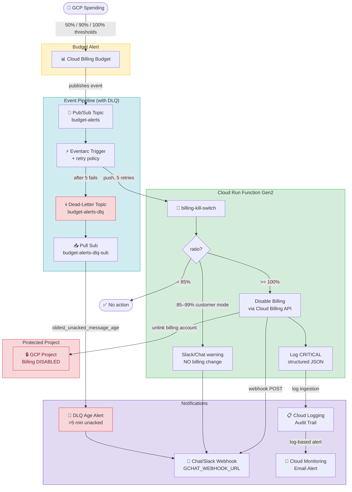

# gcp-billing-kill-switch

Claude Code skill to deploy a serverless GCP billing kill switch. Automatically disables project billing when a 100% budget alert fires. Uses Pub/Sub + Eventarc + Cloud Run Gen2.

Two deploy modes — both warn at 85–99% and disable billing at 100%. The only difference is one extra pre-kill notification:

| Ratio | `sandbox` (default) | `customer` |
|---|---|---|
| `< 85%` | no-op | no-op |
| `85–99%` | 🟡 Warning webhook + log (billing **untouched**) | 🟡 Warning webhook + log (billing **untouched**) |
| `≥ 100%` | 🔴 Disable billing + critical webhook | 🔴 Pre-kill "AUTO-KILL IMMINENT" webhook → disable billing + critical webhook |

Both modes **never cut billing below 100%**. Pick `customer` for live customer-facing projects where you want a heads-up alert moments before the kill API call fires; pick `sandbox` (default) elsewhere.

Includes a dead-letter topic on the Eventarc subscription and an age alert so silent failures of the kill switch itself page someone within ~5 min.

> ⚠️ **DESTRUCTIVE**: Disabling billing stops all services in the project. Use only when going offline is safer than unlimited spend.

## Install Skill

```bash
git clone https://github.com/satriawandicky/gcp-billing-kill-switch.git
cp gcp-billing-kill-switch/commands/gcp-billing-kill-switch.md ~/.claude/commands/
```

Invoke in Claude Code:
```
/gcp-billing-kill-switch
```

Claude will prompt for the required variables below before proceeding.

---

## Required Variables

| Variable | Example | Description |
|---|---|---|
| `PROJECT_ID` | `my-project-prod` | GCP project to protect (billing will be disabled on breach) |
| `BILLING_ACCOUNT_ID` | `01E24F-97C25D-DB772B` | Billing account linked to the project (format: `XXXXXX-XXXXXX-XXXXXX`) |
| `REGION` | `asia-southeast2` | Cloud Run deployment region (default: `asia-southeast2`) |
| `BUDGET_AMOUNT` | `100` | Monthly budget cap — number only, no currency symbol |
| `CURRENCY_CODE` | `IDR` / `USD` / `GBP` | Must match the billing account currency |

### Optional Variables

| Variable | Example | Description |
|---|---|---|
| `KILL_SWITCH_MODE` | `sandbox` / `customer` | Both modes warn at 85–99% (no billing change) and kill at 100%. `customer` adds a pre-kill imminent webhook moments before the 100% kill API call fires. Webhook required to receive warnings. |
| `GCHAT_WEBHOOK_URL` | `https://chat.googleapis.com/v1/spaces/...` *or* `https://hooks.slack.com/services/...` | Chat webhook for warnings + kill alerts. Google Chat **or** Slack — payload is compatible with both. Strongly recommended (without it, warnings only go to Cloud Logging). |
| `ALERT_EMAIL` | `admin@example.com` | Email for Cloud Monitoring alert when kill switch fires |

---

## Architecture



### Component Table

| # | Component | Technology | Role |
|---|---|---|---|
| 1 | Budget Alert | Cloud Billing | Publishes at 50% / 90% / 100% thresholds |
| 2 | Pub/Sub Topic | `budget-alerts` | Event broker (main) |
| 3 | Pub/Sub DLQ | `budget-alerts-dlq` | Captures messages after 5 failed deliveries |
| 4 | Pub/Sub DLQ Sub | `budget-alerts-dlq-sub` | Pull sub — exposes age metric for alerting |
| 5 | Eventarc Trigger | `budget-kill-trigger` | Routes Pub/Sub → Cloud Run (5 retries, DLQ on fail) |
| 6 | Cloud Run Function | Python 3.12, Gen2 | Kill switch logic with `sandbox`/`customer` modes |
| 7 | Cloud Billing API | `updateProjectBillingInfo` | Unlinks billing from project |
| 8 | Chat/Slack Webhook | Incoming Webhook | Warnings + kill alerts (Google Chat or Slack) |
| 9 | Cloud Monitoring | Log-based + DLQ age alerts | Email on trigger, page on DLQ stuck |
| 10 | Secret Manager | `gchat-killswitch-webhook` | Stores webhook URL securely |
| 11 | Cloud Logging | Structured JSON logs | Full audit trail |

## What the Skill Does (Fully Automated)

1. Enables all required GCP APIs
2. Creates dedicated Service Account with least-privilege IAM (per-project, never shared)
3. Creates Pub/Sub topic `budget-alerts` + dead-letter topic `budget-alerts-dlq` + pull sub
4. Writes and deploys Cloud Run Function (Python 3.12, Gen2) with chosen `KILL_SWITCH_MODE`
5. Creates Eventarc trigger and attaches DLQ + retry policy to the managed subscription
6. Creates DLQ age alert (pages on stuck messages = silent kill switch failure)
7. Stores Chat/Slack webhook in Secret Manager
8. Sets up Cloud Monitoring email alert
9. Runs end-to-end test and restores billing after test

**One manual step**: Connect budget alert to Pub/Sub via GCP Console (GCP API limitation for reseller sub-accounts).

---

## Source Code

See [`source/`](./source/) for the Cloud Run function files:
- `main.py` — kill switch logic with `sandbox` / `customer` modes, 85% warning branch, Chat/Slack webhook + structured logging
- `requirements.txt` — Python dependencies
- `Procfile` — Cloud Run entry point (required for functions-framework)

---

## IAM Requirements

| Role | Level | Purpose |
|---|---|---|
| `roles/run.invoker` | Project | Allow Eventarc to trigger Cloud Run |
| `roles/viewer` | Project | Read project info |
| `roles/billing.projectManager` | Project | Unlink billing from project |
| `roles/billing.admin` | **Billing Account** ⚠️ | Manage billing account associations |
| `roles/pubsub.publisher` (on DLQ) | DLQ topic | Pub/Sub service agent — required for DLQ delivery |
| `roles/pubsub.subscriber` (on source topic) | `budget-alerts` | Pub/Sub service agent — required to ack DLQ-routed msgs |

> ⚠️ `roles/billing.admin` must be at **Billing Account** level. `roles/billing.projectManager` must be at **Project** level. Both are required — missing either causes 403.

> ⚠️ **NEVER share the `billing-killswitch-sa` across projects.** Each project gets its own SA (`billing-killswitch-sa@${PROJECT_ID}.iam.gserviceaccount.com`). Cross-project SA reuse = one compromised project can disable billing on all others.

---

## Notifications

### Chat/Slack Webhook (Opsi 1)
Webhook stored in Secret Manager (`gchat-killswitch-webhook`) → injected as env var `GCHAT_WEBHOOK_URL`.
Value can be **Google Chat** or **Slack** incoming webhook — both accept `{"text": "..."}` payload.
- In `customer` mode: warning fires at 85–99%, pre-kill alert at 100%, kill confirmation after billing disabled.
- In `sandbox` mode: only the kill confirmation fires (at 100%).

Swap the secret value without redeploying:
```bash
echo -n 'NEW_URL' | gcloud secrets versions add gchat-killswitch-webhook --data-file=- --project=PROJECT_ID
gcloud run services update billing-kill-switch --region=REGION --project=PROJECT_ID
```

### DLQ Age Alert (Opsi 2 — silent failure detection)
Pull subscription `budget-alerts-dlq-sub` exposes `oldest_unacked_message_age` metric. Alert fires if a message stays in DLQ > 5 min — means the kill switch Cloud Run service failed 5 retries.

### Cloud Monitoring Email (Opsi 3)
Log-based alert detects `KILL SWITCH TRIGGERED` in Cloud Run logs → sends email.

> ℹ️ Email notification channel requires verification. When creating the channel, Google sends a code to the email address (e.g. `G-XXXXXX`). Use this to verify:
> ```bash
> curl -X POST \
>   "https://monitoring.googleapis.com/v3/projects/PROJECT_ID/notificationChannels/CHANNEL_ID:verify" \
>   -H "Authorization: Bearer $(gcloud auth print-access-token)" \
>   -H "Content-Type: application/json" \
>   -H "x-goog-user-project: PROJECT_ID" \
>   -d '{"code": "G-XXXXXX"}'
> ```

---

## Lessons Learned (from sandbox testing)

| Issue | Root Cause | Fix Applied |
|---|---|---|
| Cloud Run 503 on startup | `functions-framework` not found as entry point | Add `Procfile`: `web: functions-framework --target=kill_switch --signature-type=cloudevent` |
| 403 Forbidden on billing disable | SA missing `roles/billing.projectManager` at project level | Grant `roles/billing.projectManager` on project |
| Budget create via CLI fails `INVALID_ARGUMENT` | Reseller sub-account (IDR) doesn't support budget creation via API | Create budget manually via GCP Console |
| Email notification not received | Email notification channel not verified | Verify channel using verification code sent to email |
| Alert fires but no email | Cloud Monitoring email channel requires explicit verification even for email type | Call `:verify` endpoint with code from inbox |

---

## Manual Test

```bash
gcloud pubsub topics publish budget-alerts \
  --project=YOUR_PROJECT_ID \
  --message='{"budgetDisplayName":"TEST-KILL-SWITCH","costAmount":1000,"budgetAmount":100,"currencyCode":"USD"}'
```

Check logs:
```bash
gcloud run services logs read billing-kill-switch \
  --region=asia-southeast2 \
  --project=YOUR_PROJECT_ID \
  --limit=10
```

Expected:
```
KILL SWITCH TRIGGERED
Budget 'TEST-KILL-SWITCH': 1000 >= 100 USD
Billing DISABLED for: YOUR_PROJECT_ID
```

Restore billing after test:
```bash
gcloud billing projects link YOUR_PROJECT_ID --billing-account=YOUR_BILLING_ACCOUNT_ID
```

---

## Notes for Reseller Sub-accounts (e.g. Elitery IDR)

- Budget creation via CLI/API is **not supported** — use GCP Console
- Use `currencyCode: "IDR"` in test messages
- `roles/billing.costsManager` must be granted to the user at billing account level to create budgets via Console

---

## Cost

~$0/month — Cloud Run, Pub/Sub, Eventarc, Secret Manager, and Cloud Logging all within free tier for this workload.
